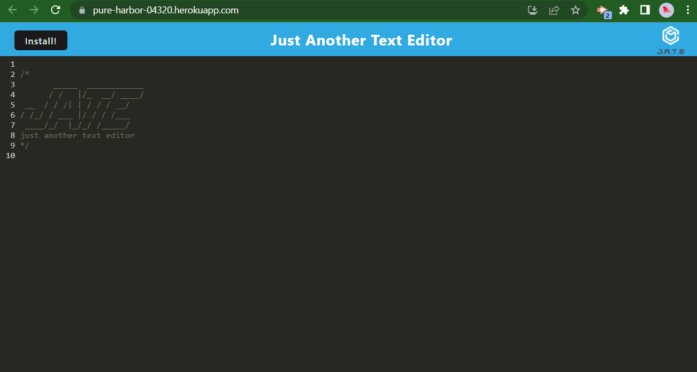

# HW19_TextEditor

## Description

This application was created to give users a text editor that can be used with or without internet. It solves the problem of apps not working when internet access is spotty or inaccesible.

## Installation

Access the application through the Heroku deployment link https://pure-harbor-04320.herokuapp.com/
Once the app is running in your browser window, click the "Install" button at the top of your page. This will give you access to the text editor on your local machine.

## Usage

Once the app in deployed and you have installed the app, you can access the text editor as seen in screenshot2.

## Credits

Cameron Buss 
